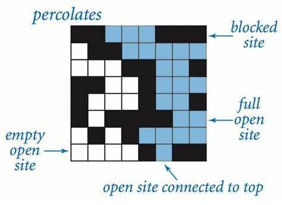

# Percolation 

## Description

This project was done as part of the course "Algorithms, Part I" on Coursera. The goal was to implement a percolation model using an N-by-N grid of sites. Each site can be either open or blocked. A full site is an open site that can be connected to an open site in the top row via a chain of neighboring (left, right, up, down) open sites. The system percolates if there is a full site in the bottom row. The goal was to estimate the percolation threshold via Monte Carlo simulation.

My implementation uses a weighted quick-union algorithm with path compression to model the percolation system, and it is working well except that i am not taking care of the backwash problem because i concidered that the simulation ends when the system percolates and not when all the sites are open. 

## Illustration


This image shows a percolation system and it was taken from the course slides on Coursera.
## Dependencies

- Java 8
- The [algs4.jar](https://algs4.cs.princeton.edu/code/) library from Princeton University (easy to find on the web).

## How to run

First download the algs4.jar file and put it in the same directory as the Percolation.java file and the PercolationStats.java file. Then compile the files using the following command:

```bash
javac -cp .:algs4.jar Percolation.java PercolationStats.java
```

Then run the PercolationStats class with the following command:

```bash
java-algs4 PercolationStats 200 100
```
the first argument is the size of the grid and the second argument is the number of simulations to run.

you should get the Monte Carlo simulation results in the console (mean, standard deviation, confidence interval of the percolation threshold).

## TODO

- [] Fix the backwash problem.
- [] Add a GUI to visualize the percolation system (Using React).
- [] Try a coupling technique as done in some one tutorial exercises exercise (probability M1).